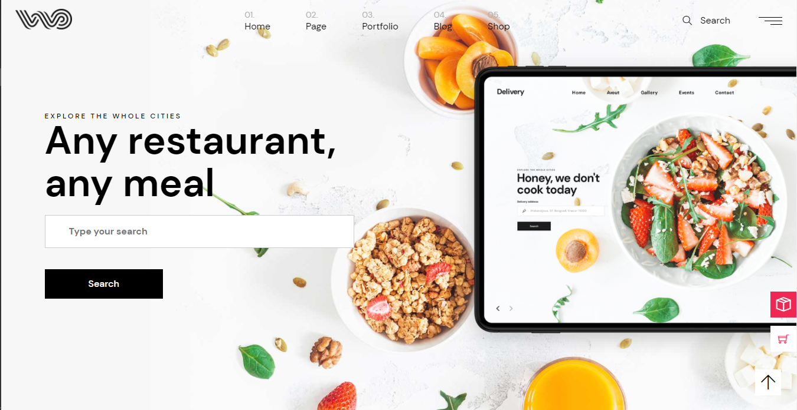

# Food Delivery Project

An e-commerce website to food delivery online

## Demo

    

**NOTE:** The features shown in the demo is not exhaustive. Only the core features are showcased in the demo.

## Tools used

1. Pug: To create the Single Page App
2. SCSS: CSS preprocessor
3. Gulp: Task runner

## How to Use

To use the project follow the steps given below:

1. Install the necessary modules (`npm install`).
2. Use `npm run app` to run app
